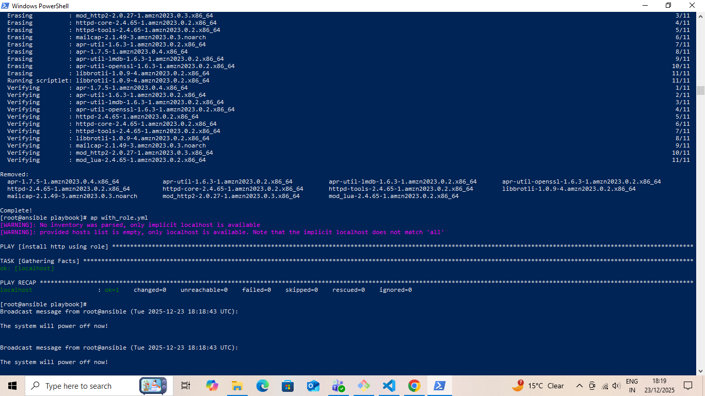
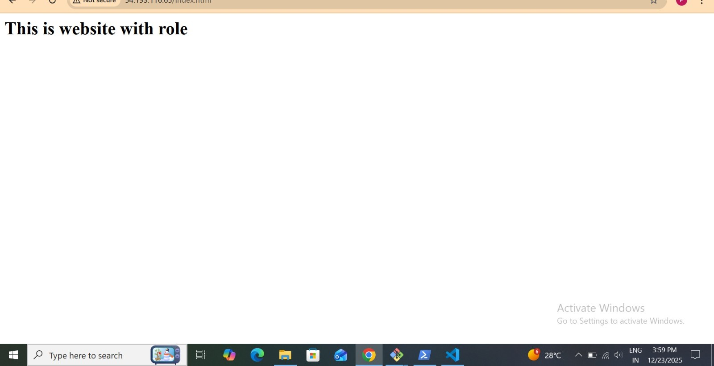
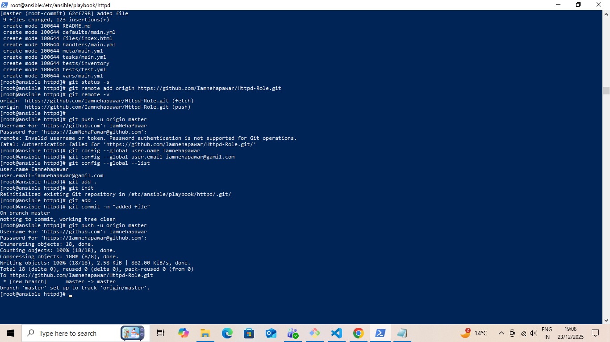
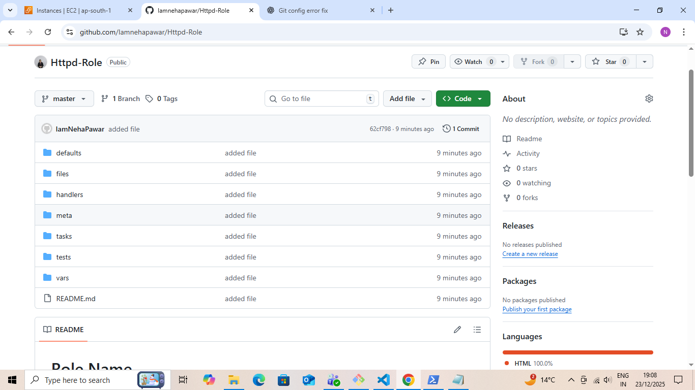
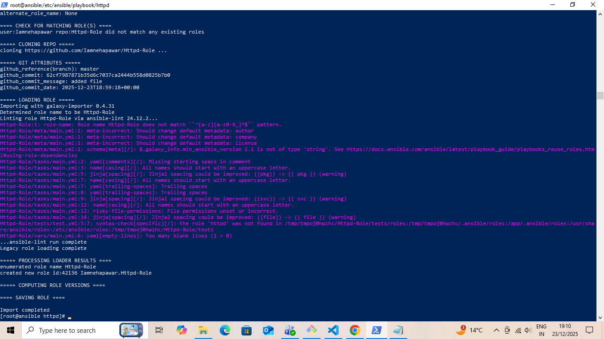
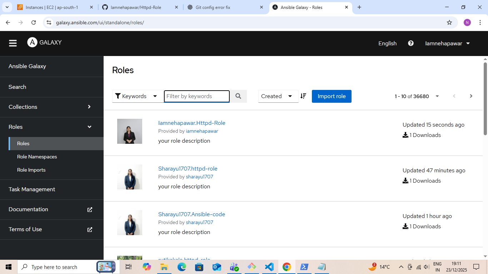

# Ansible HTTPD Role Automation 

##  Project Overview

This project demonstrates **automation of Apache HTTPD web server using Ansible**. The main goal is to understand **how Ansible playbooks work in a clean, reusable, and idempotent way**, following DevOps best practices.

The playbook installs, starts, enables the HTTPD service and deploys a sample `index.html` page automatically.

---


---

##  Technologies Used

* Ansible
* Apache HTTPD
* Amazon Linux / RHEL based OS
* Linux
* GitHub

---

##  Playbook Explanation (`with_role.yml`)

The playbook performs the following tasks:

1.  Installs HTTPD package

2. Starts and enables HTTPD service

3. Deploys a static `index.html` page

### Playbook Code

```yaml
# install http using role concept
---
- name: install http using role
  hosts: localhost
  become: yes

  vars:
    pkg: httpd
    svc: httpd
    web_root: /var/www/html

  tasks:
    - name: install httpd
      ansible.builtin.dnf:
        name: "{{ pkg }}"
        state: present

    - name: start and enable httpd
      ansible.builtin.systemd_service:
        name: "{{ svc }}"
        state: started
        enabled: true

    - name: deploy index.html page
      ansible.builtin.copy:
        src: files/index.html
        dest: "{{ web_root }}/index.html"
```

---

##  How to Run the Playbook

```bash
ansible-playbook with_role.yml
```

---

##  Verification & Screenshots

### 1. Ansible Playbook Execution




### 2. Browser Output



 Displays deployed webpage output

##  Version Control & GitHub Integration

This project is version-controlled using Git and hosted on GitHub.




---
##  Ansible Role Directory Structure




##  Ansible Galaxy Role Import




##  Ansible Galaxy Role Publication

This project was also published as an Ansible Role on **Ansible Galaxy**, making it reusable and easily shareable.

###  Published Role Screenshot


 **Role Name:** iamnehapawar.httpd-role  
 **Ansible Galaxy Profile:** https://galaxy.ansible.com/iamnehapawar


##  Key Learnings

* Infrastructure automation using Ansible
* Writing clean and readable playbooks
* Variable-driven configuration
* Idempotent automation
* Real-world DevOps workflow

---

##  Author

**Neha Pawar**

 GitHub: `github.com/Iamnehapawar>'

---


